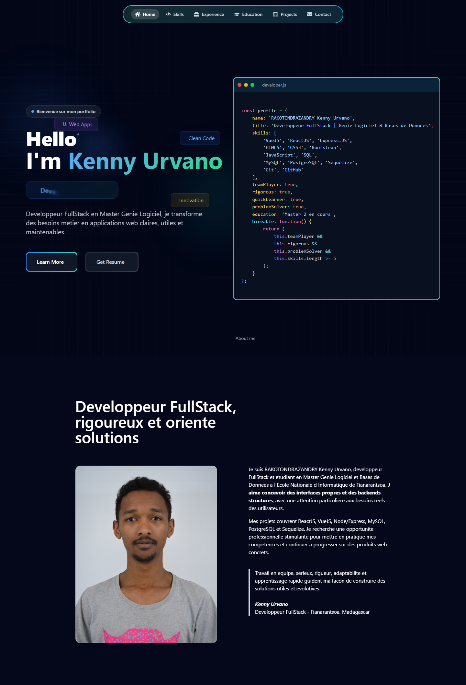

# RAKOTONDRAZANDRY Kenny Urvano

**Developpeur Fullstack | Web | Backend | Bases de donnees**

Je cree des applications web modernes, des interfaces propres et des backends structures.  
Actuellement en Master Genie Logiciel et Bases de Donnees a l'Ecole Nationale d'Informatique de Fianarantsoa.

## Languages | Frameworks & Tools

### Languages

### Frameworks

### Databases & DevOps

## GitHub stats

## Contact

- GitHub: [KennyU13](https://github.com/KennyU13)
- Email: [kennyurvano13@gmail.com](mailto:kennyurvano13@gmail.com)
- WhatsApp: [034 89 804 67](https://wa.me/261348980467)
- Location: Fianarantsoa, Madagascar
